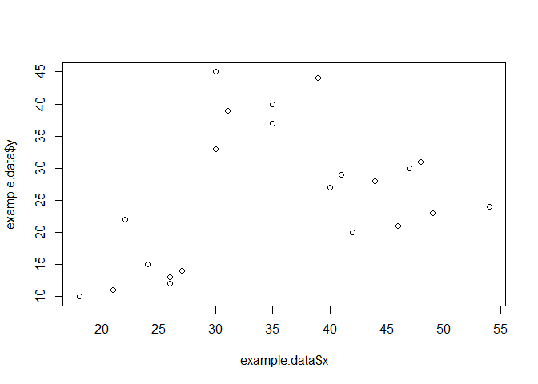
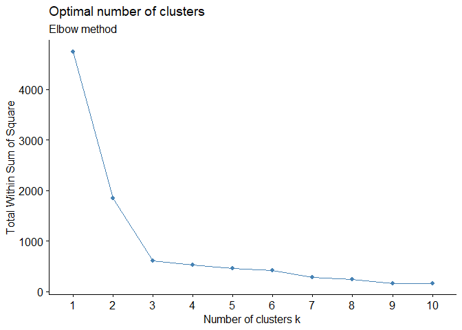
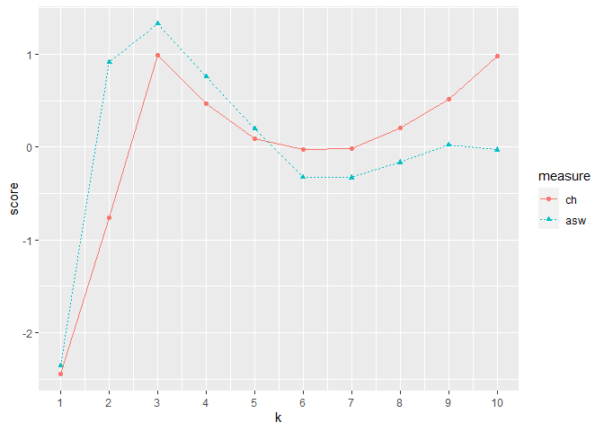

<!-- README.md is generated from README.Rmd. Please edit that file -->

## Overview

Author: Yong-Han Hank Cheng

This package provides functions for: 1. Preprocessing data. 2.
Clustering with K-means or hierarchical clustering. 3. Classification
with random forest.

Source code: <https://github.com/yhhc2/machinelearnr>

## Installation

``` r
# Install the package from GitHub
devtools::install_github("yhhc2/machinelearnr")
```

``` r
# Load package
library("machinelearnr")
```

## Usage

Visit the package’s website for function reference:
<https://yhhc2.github.io/machinelearnr/>

## Examples

All functions with example code is run in this section. The functions
are listed below in alphabetical order with example code to illustrate
how each function should be used. The example code should be very
similar to the example code in the function reference.

To see detailed descriptions for each function, please visit the
package’s website.

## Examples for clustering

### CalcOptimalNumClustersForKMeans()

``` r
example.data <- data.frame(x = c(18, 21, 22, 24, 26, 26, 27, 30, 31,
                                 35, 39, 40, 41, 42, 44, 46, 47, 48, 49, 54, 35, 30),
                          y = c(10, 11, 22, 15, 12, 13, 14, 33, 39, 37, 44,
                                27, 29, 20, 28, 21, 30, 31, 23, 24, 40, 45))

#dev.new()
plot(example.data$x, example.data$y)
```

<!-- -->

``` r
#Results should say that 3 clusters is optimal
output <- CalcOptimalNumClustersForKMeans(example.data, c("x", "y"))

elbow.plot <- output[[1]]

ch.and.asw.plot <- output[[2]]

#dev.new()
elbow.plot
```

<!-- -->

``` r
#dev.new()
ch.and.asw.plot
```

<!-- -->

### generate.2D.clustering.with.labeled.subgroup()

``` r
example.data <- data.frame(x = c(18, 21, 22, 24, 26, 26, 27, 30, 31, 35,
                                 39, 40, 41, 42, 44, 46, 47, 48, 49, 54, 35, 30),
                           y = c(10, 11, 22, 15, 12, 13, 14, 33, 39, 37, 44, 27,
                                 29, 20, 28, 21, 30, 31, 23, 24, 40, 45),
                           z = c(1, 1, 1, 1, 1, 1, 1, 1, 1, 1, 1, 1, 1,
                                 1, 1, 1, 1, 1, 1, 1, 1, 1))

#dev.new()
plot(example.data$x, example.data$y)
```

<!-- -->

``` r
km.res <- stats::kmeans(example.data[,c("x", "y", "z")], 3, nstart = 25, iter.max=10)

grouped <- km.res$cluster

pca.results <- prcomp(example.data[,c("x", "y", "z")], scale=FALSE)

actual.group.label <- c(1, 1, 1, 1, 1, 1, 1, 2, 2, 2, 2, 2, 2, 2, 2, 2, 2, 2, 2, 2, 2, 2)

generate.2D.clustering.with.labeled.subgroup(pca.results, grouped, actual.group.label,
                                             "Cluster results with actual group label circled")
```

    ## Warning in stats::chisq.test(tbl): Chi-squared approximation may be incorrect

    ##                      cluster.labels.input
    ## subgroup.labels.input 1 2 3
    ##                     1 0 7 0
    ##                     2 9 0 6
    ##  'table' int [1:2, 1:3] 0 9 7 0 0 6
    ##  - attr(*, "dimnames")=List of 2
    ##   ..$ subgroup.labels.input: chr [1:2] "1" "2"
    ##   ..$ cluster.labels.input : chr [1:3] "1" "2" "3"

### generate.3D.clustering.with.labeled.subgroup()

``` r
example.data <- data.frame(x = c(18, 21, 22, 24, 26, 26, 27, 30, 31, 35,
                                 39, 40, 41, 42, 44, 46, 47, 48, 49, 54, 35, 30),
                           y = c(10, 11, 22, 15, 12, 13, 14, 33, 39, 37, 44,
                                 27, 29, 20, 28, 21, 30, 31, 23, 24, 40, 45),
                           z = c(1, 1, 1, 1, 1, 1, 1, 2, 2, 2, 2, 2, 2, 3,
                                 3, 3, 3, 3, 3, 3, 3, 3))

#dev.new()
plot(example.data$x, example.data$y)
```

<!-- -->

``` r
km.res <- stats::kmeans(example.data[,c("x", "y", "z")], 3, nstart = 25, iter.max=10)

grouped <- km.res$cluster

pca.results <- prcomp(example.data[,c("x", "y", "z")], scale=FALSE)

actual.group.label <- c(1, 1, 1, 1, 1, 1, 1, 2, 2, 2, 2, 2, 2, 2, 2, 2, 2, 2, 2, 2, 2, 2)

generate.3D.clustering.with.labeled.subgroup(pca.results, grouped, actual.group.label,
                                             "Cluster results with actual group label")
```

    ## Warning in stats::chisq.test(tbl): Chi-squared approximation may be incorrect

``` r
#> Warning: Chi-squared approximation may be incorrect
```

### CalcOptimalNumClustersForKMeans()

### CalcOptimalNumClustersForKMeans()

## Examples for classification
