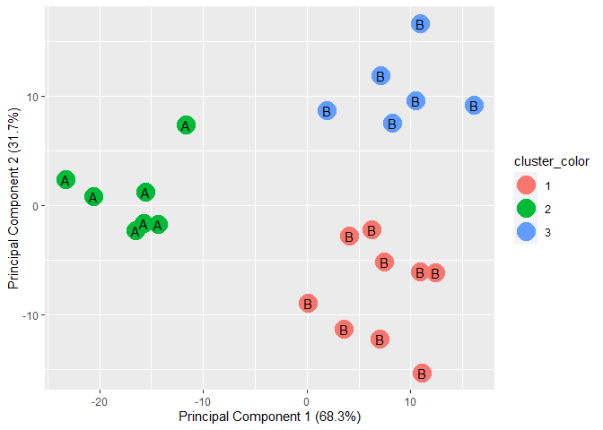
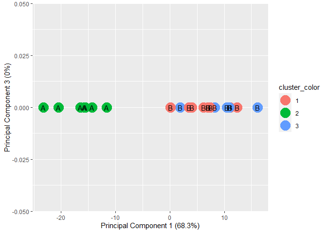
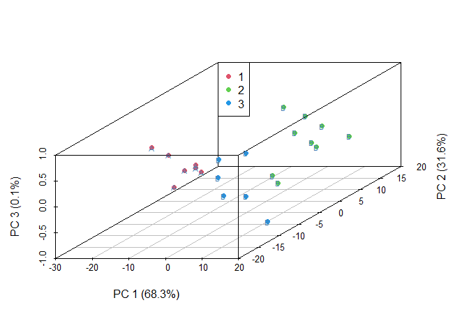
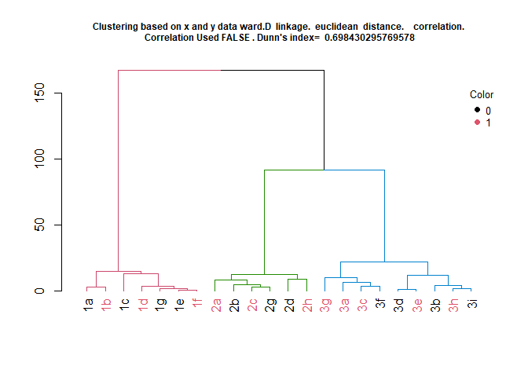
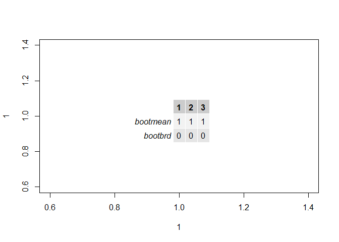

<!-- README.md is generated from README.Rmd. Please edit that file -->

## Overview

Author: Yong-Han Hank Cheng

This package provides functions for: 1. Preprocessing data. 2.
Clustering with K-means or hierarchical clustering. 3. Classification
with random forest.

Source code: <https://github.com/yhhc2/machinelearnr>

## Installation

``` r
# Install the package from GitHub
devtools::install_github("yhhc2/machinelearnr")
```

``` r
# Load package
library("machinelearnr")
```

## Usage

Visit the package’s website for function reference:
<https://yhhc2.github.io/machinelearnr/>

## Examples

All functions with example code is run in this section. The functions
are listed below in alphabetical order with example code to illustrate
how each function should be used. The example code should be very
similar to the example code in the function reference.

To see detailed descriptions for each function, please visit the
package’s website.

## Examples for clustering

### CalcOptimalNumClustersForKMeans()

``` r
example.data <- data.frame(x = c(18, 21, 22, 24, 26, 26, 27, 30, 31,
                                 35, 39, 40, 41, 42, 44, 46, 47, 48, 49, 54, 35, 30),
                          y = c(10, 11, 22, 15, 12, 13, 14, 33, 39, 37, 44,
                                27, 29, 20, 28, 21, 30, 31, 23, 24, 40, 45))

#dev.new()
plot(example.data$x, example.data$y)
```

<!-- -->

``` r
#Results should say that 3 clusters is optimal
output <- CalcOptimalNumClustersForKMeans(example.data, c("x", "y"))

elbow.plot <- output[[1]]

ch.and.asw.plot <- output[[2]]

#dev.new()
elbow.plot
```

<!-- -->

``` r
#dev.new()
ch.and.asw.plot
```

<!-- -->

### generate.2D.clustering.with.labeled.subgroup()

``` r
example.data <- data.frame(x = c(18, 21, 22, 24, 26, 26, 27, 30, 31, 35,
                                 39, 40, 41, 42, 44, 46, 47, 48, 49, 54, 35, 30),
                           y = c(10, 11, 22, 15, 12, 13, 14, 33, 39, 37, 44, 27,
                                 29, 20, 28, 21, 30, 31, 23, 24, 40, 45),
                           z = c(1, 1, 1, 1, 1, 1, 1, 1, 1, 1, 1, 1, 1,
                                 1, 1, 1, 1, 1, 1, 1, 1, 1))

#dev.new()
plot(example.data$x, example.data$y)
```

<!-- -->

``` r
km.res <- stats::kmeans(example.data[,c("x", "y", "z")], 3, nstart = 25, iter.max=10)

grouped <- km.res$cluster

pca.results <- prcomp(example.data[,c("x", "y", "z")], scale=FALSE)

actual.group.label <- c("A", "A", "A", "A", "A", "A", "A", "B", "B", "B", "B", 
                        "B", "B", "B", "B", "B", "B", "B", "B", "B", "B", "B")

results <- generate.2D.clustering.with.labeled.subgroup(pca.results, grouped, actual.group.label)

#PC1 vs PC2
print(results[[1]])
```

<!-- -->

``` r
#PC1 vs PC3
print(results[[2]])
```

<!-- -->

``` r
#Chi-square results
print(results[[3]])
```

    ## 
    ##  Pearson's Chi-squared test
    ## 
    ## data:  tbl
    ## X-squared = 22, df = 2, p-value = 1.67e-05

``` r
#Table
print(results[[4]])
```

    ##                      cluster.labels.input
    ## subgroup.labels.input 1 2 3
    ##                     A 0 7 0
    ##                     B 9 0 6

### generate.3D.clustering.with.labeled.subgroup()

``` r
example.data <- data.frame(x = c(18, 21, 22, 24, 26, 26, 27, 30, 31, 35,
                                 39, 40, 41, 42, 44, 46, 47, 48, 49, 54, 35, 30),
                           y = c(10, 11, 22, 15, 12, 13, 14, 33, 39, 37, 44,
                                 27, 29, 20, 28, 21, 30, 31, 23, 24, 40, 45),
                           z = c(1, 1, 1, 1, 1, 1, 1, 2, 2, 2, 2, 2, 2, 3,
                                 3, 3, 3, 3, 3, 3, 3, 3))

#dev.new()
plot(example.data$x, example.data$y)
```

<!-- -->

``` r
km.res <- stats::kmeans(example.data[,c("x", "y", "z")], 3, nstart = 25, iter.max=10)

grouped <- km.res$cluster

pca.results <- prcomp(example.data[,c("x", "y", "z")], scale=FALSE)

actual.group.label <- c("A", "A", "A", "A", "A", "A", "A", "B", "B", "B", "B", 
"B", "B", "B", "B", "B", "B", "B", "B", "B", "B", "B")

results <- generate.3D.clustering.with.labeled.subgroup(pca.results, grouped, actual.group.label)

xlab.values <- results[[1]]
ylab.values <- results[[2]]
zlab.values <- results[[3]]
xdata.values <- results[[4]]
ydata.values <- results[[5]]
zdata.values <- results[[6]]

data.to.plot <- data.frame(xdata.values, ydata.values, zdata.values)

#Interactive 3d plot, but cannot display in html or md
rgl::rgl.bg(color = "white")
rgl::plot3d(x= xdata.values, y= ydata.values, z= zdata.values,
xlab = xlab.values, ylab = ylab.values, zlab = zlab.values, col=(grouped+1), pch=20, cex=2)
rgl::text3d(x= xdata.values, y= ydata.values, z= zdata.values, text= actual.group.label, cex=1)
rgl::rglwidget()
```

<!-- -->

``` r
#Non-interactive 3d plot
s3d <- scatterplot3d::scatterplot3d(data.to.plot[,1:3], pch = 16, color=(grouped+1),
                                    xlab = xlab.values, ylab = ylab.values, 
                                    zlab = zlab.values)

legend(s3d$xyz.convert(-30, 20, 1), legend = levels(as.factor(grouped)),
      col = levels(as.factor(grouped+1)), pch = 16)

text(s3d$xyz.convert(data.to.plot[,1:3]), labels = actual.group.label,
     cex= 0.7, col = "steelblue")
```

<!-- -->

### generate.plots.comparing.clusters()

``` r
example.data <- data.frame(x = c(18, 21, 22, 24, 26, 26, 27, 30, 31,
                                 35, 39, 40, 41, 42, 44, 46, 47, 48, 49, 54, 35, 30),
                          y = c(10, 11, 22, 15, 12, 13, 14, 33, 39, 37, 44,
                                27, 29, 20, 28, 21, 30, 31, 23, 24, 40, 45))

dev.new()
plot(example.data$x, example.data$y)

km.res <- stats::kmeans(example.data[,c("x", "y")], 3, nstart = 25, iter.max=10)

grouped <- km.res$cluster

generate.plots.comparing.clusters(example.data, grouped, c("x", "y"))
```

### GenerateParcoordForClusters()

``` r
example.data <- data.frame(x = c(18, 21, 22, 24, 26, 26, 27, 30, 31,
                                 35, 39, 40, 41, 42, 44, 46, 47, 48, 49, 54, 35, 30),
                          y = c(10, 11, 22, 15, 12, 13, 14, 33, 39, 37, 44,
                                27, 29, 20, 28, 21, 30, 31, 23, 24, 40, 45))

plot(example.data$x, example.data$y)
```

<!-- -->

``` r
km.res <- stats::kmeans(example.data[,c("x", "y")], 3, nstart = 25, iter.max=10)

grouped <- km.res$cluster

example.data <- cbind(example.data, grouped)

print(GenerateParcoordForClusters(example.data, "grouped", c("x", "y")))
```

<!-- -->

    ## $rect
    ## $rect$w
    ## [1] 0.2535938
    ## 
    ## $rect$h
    ## [1] 0.3827849
    ## 
    ## $rect$left
    ## [1] 1.786406
    ## 
    ## $rect$top
    ## [1] 1.04
    ## 
    ## 
    ## $text
    ## $text$x
    ## [1] 1.876406 1.876406 1.876406 1.876406 1.876406 1.876406
    ## 
    ## $text$y
    ## [1] 0.9853164 0.9306329 0.8759493 0.8212658 0.7665822 0.7118986

### HierarchicalClustering()

``` r
id = c("1a", "1b", "1c", "1d", "1e", "1f", "1g", "2a", "2b", "2c", "2d", "3h", "3i", "3a",
       "3b", "3c", "3d", "3e", "3f", "3g", "2g", "2h")

x = c(18, 21, 22, 24, 26, 26, 27, 30, 31, 35, 39, 40, 41, 42, 44, 46, 47, 48, 49, 54, 35, 30)

y = c(10, 11, 22, 15, 12, 13, 14, 33, 39, 37, 44, 27, 29, 20, 28, 21, 30, 31, 23, 24, 40, 45)

color = as.factor(c(0, 1, 0, 1, 0, 1, 0, 1, 0, 1, 0, 1, 0, 1, 0, 1, 0, 1, 0, 1, 0, 1))

example.data <- data.frame(id, x, y, color)

#dev.new()
plot(example.data$x, example.data$y)
text(example.data$x, example.data$y, labels = id, cex=0.9, font=2)
```

<!-- -->

``` r
results <- HierarchicalClustering(working.data = example.data,
                       clustering.columns = c("x", "y"),
                       label.column.name = "id",
                       grouping.column.name = "color",
                       number.of.clusters.to.use = 3,
                       distance_method = "euclidean",
                       correlation_method = NULL,
                       linkage_method_type = "ward.D",
                       Use.correlation.for.hclust = FALSE,
                       terminal.branch.font.size = 1,
                       title.to.use = "Clustering based on x and y data")
                       
hclust.res <- results[[1]]
dend <- results[[2]]
kcboot.res <- results[[3]]
title.to.use <- results[[4]]
labeled.samples <- results[[5]]
stability.table <- results[[6]]
                     
#Plot dendrogram                         
plot(dend, main = title.to.use, cex.main = 0.75)

#Add legend to dendrogram
legend.labels.to.use <- levels(example.data[,"color"])
col.to.use <- as.integer(levels(example.data[,"color"])) + 1
pch.to.use <- rep(20, times = length(legend.labels.to.use))
graphics::legend("topright",
      legend = legend.labels.to.use,
      col = col.to.use,
      pch = pch.to.use, bty = "n",  pt.cex = 1.5, cex = 0.8 ,
      text.col = "black", horiz = FALSE, inset = c(0, 0.1),
      title = "Color")
```

<!-- -->

``` r
#Display sample assignment
labeled.samples
```

    ## 1a 1b 1c 1d 1g 1e 1f 2a 2b 2c 2g 2d 2h 3g 3a 3c 3f 3d 3e 3b 3h 3i 
    ##  1  1  1  1  1  1  1  2  2  2  2  2  2  3  3  3  3  3  3  3  3  3

``` r
#Display stability of clusters
plot(1,1)
gridExtra::grid.table(stability.table)
```

<!-- -->

``` r
#Display kcboot full output
kcboot.res
```

    ## * Cluster stability assessment *
    ## Cluster method:  hclust 
    ## Full clustering results are given as parameter result
    ## of the clusterboot object, which also provides further statistics
    ## of the resampling results.
    ## Number of resampling runs:  100 
    ## 
    ## Number of clusters found in data:  3 
    ## 
    ##  Clusterwise Jaccard bootstrap (omitting multiple points) mean:
    ## [1] 1 1 1
    ## dissolved:
    ## [1] 0 0 0
    ## recovered:
    ## [1] 100 100 100

## Examples for classification
