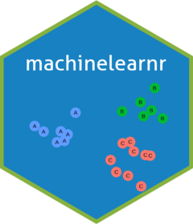

<!-- README.md is generated from README.Rmd. Please edit that file -->

# machinelearnr <a href='https://yhhc2.github.io/machinelearnr/'></a>

<!-- badges: start -->
[](https://github.com/yhhc2/machinelearnr/actions)
<!-- badges: end -->

## Overview

Author: Yong-Han Hank Cheng

This package provides functions for: 1. Preprocessing data. 2.
Clustering with K-means or hierarchical clustering. 3. Classification
with random forest.

The main functions for clustering are:

  - HierarchicalClustering(): This can be used to create dendrograms.
    The linkage type and distance type used for clustering can be
    specified. Additionally, the stability of the clusters can also be
    calculated. The name of the observations are displayed at the leaves
    and additional coloring can be added to the leaves in addition to
    the cluster coloring.
    
  - generate.3D.clustering.with.labeled.subgroup(): After kmeans
    clustering is performed, it is often helpful to visualize what the
    clusters look like. If 3 or more variables were used for clustering,
    PCA can be performed and the points can be plotted with the top 3
    components to visualize what clusters look like in 3D. 

The main functions for classification are:

  - RandomForestAutomaticMtryAndNtree(): This uses the
    randomForest::randomForest function to create a random forest
    classifier. Additional code is included for optimizing mtry and
    ntree. Importantly, the default values for mtry and ntree are
    sensible values and actually is not required to be adjusted. For
    more rigorous explanation hyperparameter tuning, use this paper and
    the R package provided by the authors:
    <https://doi.org/10.1002/widm.1301>, “Hyperparameters and tuning
    strategies for random forest” by Probst et al.

  - CVPredictionsRandomForest(): This performs random forest
    classification using default hyperparameters and also uses
    cross-validation. The cross-validation fold can be specified by the
    user.

  - CVRandomForestClassificationMatrixForPheatmap(): This uses
    CVPredictionsRandomForest() on several smaller subset data sets of a
    larger data set and outputs results in the form of a pheatmap so
    that the random forest performance can be compared between each
    subset.
    

## Installation

``` r
# Install the package from GitHub
devtools::install_github("yhhc2/machinelearnr")
```

``` r
# Load package
library("machinelearnr")
```

## Usage

Source code: <https://github.com/yhhc2/machinelearnr>

Visit the package’s website: <https://yhhc2.github.io/machinelearnr/>

Function reference is located here:
<https://yhhc2.github.io/machinelearnr/reference/index.html>

Visit this vignette for example output for each function usage:
<https://yhhc2.github.io/machinelearnr/articles/Examples.html>

## License

The psdr package is licensed under the GPL (\>=3) license. The logo is
licensed under the
<a href='https://creativecommons.org/licenses/by/4.0/'> CC BY 4.0
license</a>.
