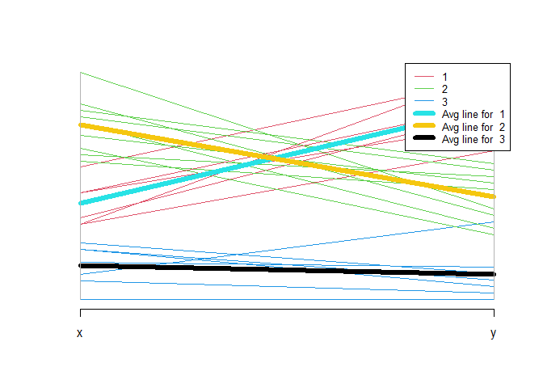

<!-- README.md is generated from README.Rmd. Please edit that file -->

## Overview

Author: Yong-Han Hank Cheng

This package provides functions for: 1. Preprocessing data. 2.
Clustering with K-means or hierarchical clustering. 3. Classification
with random forest.

Source code: <https://github.com/yhhc2/machinelearnr>

## Installation

``` r
# Install the package from GitHub
devtools::install_github("yhhc2/machinelearnr")
```

``` r
# Load package
library("machinelearnr")
```

## Usage

Visit the package’s website for function reference:
<https://yhhc2.github.io/machinelearnr/>

## Examples

All functions with example code is run in this section. The functions
are listed below in alphabetical order with example code to illustrate
how each function should be used. The example code should be very
similar to the example code in the function reference.

To see detailed descriptions for each function, please visit the
package’s website.

## Examples for clustering

### CalcOptimalNumClustersForKMeans()

``` r
example.data <- data.frame(x = c(18, 21, 22, 24, 26, 26, 27, 30, 31,
                                 35, 39, 40, 41, 42, 44, 46, 47, 48, 49, 54, 35, 30),
                          y = c(10, 11, 22, 15, 12, 13, 14, 33, 39, 37, 44,
                                27, 29, 20, 28, 21, 30, 31, 23, 24, 40, 45))

#dev.new()
plot(example.data$x, example.data$y)
```

<!-- -->

``` r
#Results should say that 3 clusters is optimal
output <- CalcOptimalNumClustersForKMeans(example.data, c("x", "y"))

elbow.plot <- output[[1]]

ch.and.asw.plot <- output[[2]]

#dev.new()
elbow.plot
```

<!-- -->

``` r
#dev.new()
ch.and.asw.plot
```

<!-- -->

### generate.2D.clustering.with.labeled.subgroup()

``` r
example.data <- data.frame(x = c(18, 21, 22, 24, 26, 26, 27, 30, 31, 35,
                                 39, 40, 41, 42, 44, 46, 47, 48, 49, 54, 35, 30),
                           y = c(10, 11, 22, 15, 12, 13, 14, 33, 39, 37, 44, 27,
                                 29, 20, 28, 21, 30, 31, 23, 24, 40, 45),
                           z = c(1, 1, 1, 1, 1, 1, 1, 1, 1, 1, 1, 1, 1,
                                 1, 1, 1, 1, 1, 1, 1, 1, 1))

dev.new()
plot(example.data$x, example.data$y)

km.res <- stats::kmeans(example.data[,c("x", "y", "z")], 3, nstart = 25, iter.max=10)

grouped <- km.res$cluster

pca.results <- prcomp(example.data[,c("x", "y", "z")], scale=FALSE)

actual.group.label <- c("A", "A", "A", "A", "A", "A", "A", "B", "B", "B", "B", 
                        "B", "B", "B", "B", "B", "B", "B", "B", "B", "B", "B")

results <- generate.2D.clustering.with.labeled.subgroup(pca.results, grouped, actual.group.label)

#PC1 vs PC2
print(results[[1]])

#PC1 vs PC3
print(results[[2]])

#Chi-square results
print(results[[3]])
```

    ## 
    ##  Pearson's Chi-squared test
    ## 
    ## data:  tbl
    ## X-squared = 22, df = 2, p-value = 1.67e-05

``` r
#Table
print(results[[4]])
```

    ##                      cluster.labels.input
    ## subgroup.labels.input 1 2 3
    ##                     A 0 7 0
    ##                     B 9 0 6

### generate.3D.clustering.with.labeled.subgroup()

``` r
knitr::opts_chunk$set(echo = TRUE)
options(rgl.useNULL=TRUE)
library(rgl)
```

    ## Warning: package 'rgl' was built under R version 4.0.5

``` r
knitr::knit_hooks$set(webgl = hook_webgl)

#Allow html to work in md
webshot::install_phantomjs()
```

    ## It seems that the version of `phantomjs` installed is greater than or equal to the requested version.To install the requested version or downgrade to another version, use `force = TRUE`.

``` r
example.data <- data.frame(x = c(18, 21, 22, 24, 26, 26, 27, 30, 31, 35,
                                 39, 40, 41, 42, 44, 46, 47, 48, 49, 54, 35, 30),
                           y = c(10, 11, 22, 15, 12, 13, 14, 33, 39, 37, 44,
                                 27, 29, 20, 28, 21, 30, 31, 23, 24, 40, 45),
                           z = c(1, 1, 1, 1, 1, 1, 1, 2, 2, 2, 2, 2, 2, 3,
                                 3, 3, 3, 3, 3, 3, 3, 3))

#dev.new()
plot(example.data$x, example.data$y)
```

<!-- -->

``` r
km.res <- stats::kmeans(example.data[,c("x", "y", "z")], 3, nstart = 25, iter.max=10)

grouped <- km.res$cluster

pca.results <- prcomp(example.data[,c("x", "y", "z")], scale=FALSE)

actual.group.label <- c("A", "A", "A", "A", "A", "A", "A", "B", "B", "B", "B", 
"B", "B", "B", "B", "B", "B", "B", "B", "B", "B", "B")

results <- generate.3D.clustering.with.labeled.subgroup(pca.results, grouped, actual.group.label)

xlab.values <- results[[1]]
ylab.values <- results[[2]]
zlab.values <- results[[3]]
xdata.values <- results[[4]]
ydata.values <- results[[5]]
zdata.values <- results[[6]]

rgl::rgl.bg(color = "white")

rgl::plot3d(x= xdata.values, y= ydata.values, z= zdata.values,
xlab = xlab.values, ylab = ylab.values, zlab = zlab.values, col=(grouped+1), pch=20, cex=2)

rgl::text3d(x= xdata.values, y= ydata.values, z= zdata.values, text= actual.group.label, cex=1)

rgl::rglwidget()
```

<!-- -->

### generate.plots.comparing.clusters()

``` r
example.data <- data.frame(x = c(18, 21, 22, 24, 26, 26, 27, 30, 31,
                                 35, 39, 40, 41, 42, 44, 46, 47, 48, 49, 54, 35, 30),
                          y = c(10, 11, 22, 15, 12, 13, 14, 33, 39, 37, 44,
                                27, 29, 20, 28, 21, 30, 31, 23, 24, 40, 45))

dev.new()
plot(example.data$x, example.data$y)

km.res <- stats::kmeans(example.data[,c("x", "y")], 3, nstart = 25, iter.max=10)

grouped <- km.res$cluster

generate.plots.comparing.clusters(example.data, grouped, c("x", "y"))
```

### GenerateParcoordForClusters()

``` r
example.data <- data.frame(x = c(18, 21, 22, 24, 26, 26, 27, 30, 31,
                                 35, 39, 40, 41, 42, 44, 46, 47, 48, 49, 54, 35, 30),
                          y = c(10, 11, 22, 15, 12, 13, 14, 33, 39, 37, 44,
                                27, 29, 20, 28, 21, 30, 31, 23, 24, 40, 45))

plot(example.data$x, example.data$y)
```

<!-- -->

``` r
km.res <- stats::kmeans(example.data[,c("x", "y")], 3, nstart = 25, iter.max=10)

grouped <- km.res$cluster

example.data <- cbind(example.data, grouped)

print(GenerateParcoordForClusters(example.data, "grouped", c("x", "y")))
```

<!-- -->

    ## $rect
    ## $rect$w
    ## [1] 0.2535938
    ## 
    ## $rect$h
    ## [1] 0.3827849
    ## 
    ## $rect$left
    ## [1] 1.786406
    ## 
    ## $rect$top
    ## [1] 1.04
    ## 
    ## 
    ## $text
    ## $text$x
    ## [1] 1.876406 1.876406 1.876406 1.876406 1.876406 1.876406
    ## 
    ## $text$y
    ## [1] 0.9853164 0.9306329 0.8759493 0.8212658 0.7665822 0.7118986

### HierarchicalClustering()

``` r
id = c("1a", "1b", "1c", "1d", "1e", "1f", "1g", "2a", "2b", "2c", "2d", "3h", "3i", "3a",
       "3b", "3c", "3d", "3e", "3f", "3g", "2g", "2h")

x = c(18, 21, 22, 24, 26, 26, 27, 30, 31, 35, 39, 40, 41, 42, 44, 46, 47, 48, 49, 54, 35, 30)

y = c(10, 11, 22, 15, 12, 13, 14, 33, 39, 37, 44, 27, 29, 20, 28, 21, 30, 31, 23, 24, 40, 45)

color = as.factor(c(0, 1, 0, 1, 0, 1, 0, 1, 0, 1, 0, 1, 0, 1, 0, 1, 0, 1, 0, 1, 0, 1))

example.data <- data.frame(id, x, y, color)

#dev.new()
plot(example.data$x, example.data$y)
text(example.data$x, example.data$y, labels = id, cex=0.9, font=2)
```

<!-- -->

``` r
HierarchicalClustering(working.data = example.data,
                       clustering.columns = c("x", "y"),
                       label.column.name = "id",
                       grouping.column.name = "color",
                       number.of.clusters.to.use = 3,
                       distance_method = "euclidean",
                       correlation_method = NULL,
                       linkage_method_type = "ward.D",
                       Use.correlation.for.hclust = FALSE,
                       terminal.branch.font.size = 1,
                       title.to.use = "Clustering based on x and y data")
```

    ## [1] "Clustering based on x and y data ward.D  linkage.  euclidean  distance.    correlation.\n Correlation Used FALSE . Dunn's index=  0.698430295769578"
    ## [1] "Cluster assignment"
    ## 1a 1b 1c 1d 1g 1e 1f 2a 2b 2c 2g 2d 2h 3g 3a 3c 3f 3d 3e 3b 3h 3i 
    ##  1  1  1  1  1  1  1  2  2  2  2  2  2  3  3  3  3  3  3  3  3  3 
    ## boot 1 
    ## boot 2 
    ## boot 3 
    ## boot 4 
    ## boot 5 
    ## boot 6 
    ## boot 7 
    ## boot 8 
    ## boot 9 
    ## boot 10 
    ## boot 11 
    ## boot 12 
    ## boot 13 
    ## boot 14 
    ## boot 15 
    ## boot 16 
    ## boot 17 
    ## boot 18 
    ## boot 19 
    ## boot 20 
    ## boot 21 
    ## boot 22 
    ## boot 23 
    ## boot 24 
    ## boot 25 
    ## boot 26 
    ## boot 27 
    ## boot 28 
    ## boot 29 
    ## boot 30 
    ## boot 31 
    ## boot 32 
    ## boot 33 
    ## boot 34 
    ## boot 35 
    ## boot 36 
    ## boot 37 
    ## boot 38 
    ## boot 39 
    ## boot 40 
    ## boot 41 
    ## boot 42 
    ## boot 43 
    ## boot 44 
    ## boot 45 
    ## boot 46 
    ## boot 47 
    ## boot 48 
    ## boot 49 
    ## boot 50 
    ## boot 51 
    ## boot 52 
    ## boot 53 
    ## boot 54 
    ## boot 55 
    ## boot 56 
    ## boot 57 
    ## boot 58 
    ## boot 59 
    ## boot 60 
    ## boot 61 
    ## boot 62 
    ## boot 63 
    ## boot 64 
    ## boot 65 
    ## boot 66 
    ## boot 67 
    ## boot 68 
    ## boot 69 
    ## boot 70 
    ## boot 71 
    ## boot 72 
    ## boot 73 
    ## boot 74 
    ## boot 75 
    ## boot 76 
    ## boot 77 
    ## boot 78 
    ## boot 79 
    ## boot 80 
    ## boot 81 
    ## boot 82 
    ## boot 83 
    ## boot 84 
    ## boot 85 
    ## boot 86 
    ## boot 87 
    ## boot 88 
    ## boot 89 
    ## boot 90 
    ## boot 91 
    ## boot 92 
    ## boot 93 
    ## boot 94 
    ## boot 95 
    ## boot 96 
    ## boot 97 
    ## boot 98 
    ## boot 99 
    ## boot 100

    ## [[1]]
    ## 
    ## Call:
    ## stats::hclust(d = data.dist, method = linkage_method_type)
    ## 
    ## Cluster method   : ward.D 
    ## Distance         : euclidean 
    ## Number of objects: 22 
    ## 
    ## 
    ## [[2]]
    ## 'dendrogram' with 2 branches and 22 members total, at height 167.2036 
    ## 
    ## [[3]]
    ## * Cluster stability assessment *
    ## Cluster method:  hclust 
    ## Full clustering results are given as parameter result
    ## of the clusterboot object, which also provides further statistics
    ## of the resampling results.
    ## Number of resampling runs:  100 
    ## 
    ## Number of clusters found in data:  3 
    ## 
    ##  Clusterwise Jaccard bootstrap (omitting multiple points) mean:
    ## [1] 1 1 1
    ## dissolved:
    ## [1] 0 0 0
    ## recovered:
    ## [1] 100 100 100

## Examples for classification
